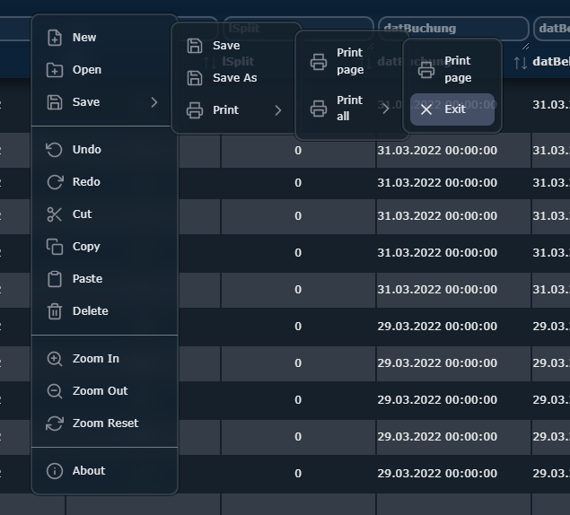

# contextmenu



This project provides a JavaScript solution to create customizable right-click context menus in web applications. The context menu is fully customizable and allows adding actions and submenus.


## Setup

To use the context menu in your project, simply copy the code from `contextmenu.js` and paste it into your JavaScript file or include it directly into your HTML file.

```html
<script type="text/javascript" src="contextmenu.js"></script>
```

# Usage
Create a new context menu by calling the createContextMenu function with the menu structure and the optional targetElementId.


Example
here is an example of a menu structure. You can use this example as a starting point for creating your own context menu.
```js 
const menuStructure = [
	{
		label: 'File',
		style: 'color: red',
		list: [
			{
				label: 'New',
				icon: 'file-plus',
				style: 'color: green',
				action: () => {
					console.log('New');
				},
			},
			{
				label: 'Open',
				icon: 'folder-plus',
				action: () => {
					console.log('Open');
				},
			},
			{
				label: 'Save',
				icon: 'save',
				action: () => {
					console.log('Save');
				},
				submenu: [
					{
						label: 'Save',
						icon: 'save',
						style: 'color: blue',
						action: () =>
						{
							console.log('Save');
						},
					},
					{
						label: 'Save As',
						icon: 'save',
						action: () =>
						{
							console.log('Save As');
						},
					},
					{
						label: 'Print',
						icon: 'printer',
						action: () =>
						{
							console.log('Print');
						},
						submenu: [
							{
								label: 'Print page',
								icon: 'printer',
								action: () =>
								{
									console.log('Print page');
								}
							},
							{
								label: 'Print all',
								icon: 'printer',
								action: () =>
								{
									console.log('Print all');
								},
								submenu: [
									{
										label: 'Print page',
										icon: 'printer',
										action: () =>
										{
											console.log('Print page');
										}
									}
								]
							}
						]
					}
				]
			},
			{
				label: 'Exit',
				icon: 'x',
				action: () => {
					console.log('Exit');
				},
			},
		],
	},
	{
		label: 'Edit',
		list: [
			{
				label: 'Undo',
				icon: 'rotate-ccw',
				action: () => {
					console.log('Undo');
				},
			},
			{
				label: 'Redo',
				icon: 'rotate-cw',
				action: () => {
					console.log('Redo');
				},
			},
			{
				label: 'Cut',
				icon: 'scissors',
				action: () => {
					console.log('Cut');
				},
			},
			{
				label: 'Copy',
				icon: 'copy',
				action: () => {
					console.log('Copy');
				},
			},
			{
				label: 'Paste',
				icon: 'clipboard',
				action: () => {
					console.log('Paste');
				},
			},
			{
				label: 'Delete',
				icon: 'trash-2',
				action: () => {
					console.log('Delete');
				},
			},
		],
	},
	{
		label: 'View',
		list: [
			{
				label: 'Zoom In',
				icon: 'zoom-in',
				action: () => {
					console.log('Zoom In');
				},
			},
			{
				label: 'Zoom Out',
				icon: 'zoom-out',
				action: () => {
					console.log('Zoom Out');
				},
			},
			{
				label: 'Zoom Reset',
				icon: 'refresh-cw',
				action: () => {
					console.log('Zoom Reset');
				},
			},
		],
	},
	{
		label: 'Help',
		list: [
			{
				label: 'About',
				icon: 'info',
                style: 'color: red',
				action: () => {
					console.log('About');
				},
			},
		],
	},
];

createContextMenu('target-element-id', menuStructure);
```


The menuStructure is an array of menu objects, each of which can contain a label, a list of list items, and optionally a submenu. Each menu item in the list can have an action and a submenu.


